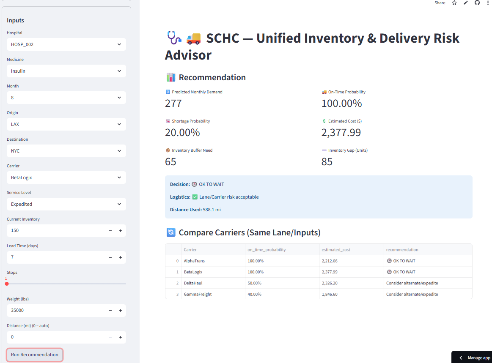

# 🩺🚚 Supply Chain + Healthcare (SCHC) Advisor

This project explores how **data and machine learning** can support better decision-making in two critical areas:  
- **Healthcare** → hospital medicine inventory  
- **Supply Chain Logistics** → shipping performance and carrier reliability  

It started as part of my **IBM AI Engineering Certification** and grew into a hands-on project with notebooks, data simulations, and an interactive **Streamlit app** that makes the results accessible to both technical and non-technical users.  

---

## 📓 Project Notebooks  

1. **🏥 Healthcare Notebook (`proj_01_healthcare.ipynb`)**  
   - Simulates hospital demand for medicines.  
   - Predicts when inventory might run low.  
   - Provides a clear recommendation: **Order Now** or **Safe to Wait**.  

2. **🚚 Supply Chain Notebook (`proj_01_supplychain.ipynb`)**  
   - Simulates shipping data across lanes (origin → destination by carrier).  
   - Estimates on-time delivery probability and shipping costs.  
   - Lets you compare carriers and spot delivery risks.  

3. **🔗 Unified Notebook (`proj_01_unified.ipynb`)**  
   - Combines both perspectives.  
   - Shows how shipping delays can directly impact medicine shortages at hospitals.  
   - Provides a combined recommendation that balances **demand, delivery risk, and cost**.  

---

## 🌐 Interactive App (Streamlit)  

The **Streamlit app** makes it easy for anyone—technical or not—to explore the results.  

### 🛠️ How to Use  
1. Open the app in your browser.  
2. Use the **sidebar** to set your inputs:  
   - 🏥 Hospital and 💊 Medicine  
   - 📦 Current Inventory and 📅 Lead Time (days)  
   - 🛫 Origin, 🛬 Destination, 🚚 Carrier, and ⚙️ Service Level  
3. Click **▶️ Run Recommendation**.  

### 📊 What You’ll See  
- 🔢 **Predicted Monthly Demand** → How much of the medicine is needed.  
- 📉 **Shortage Probability** → Risk of running out of stock.  
- 📦 **Inventory Buffer Need** → Safety stock required.  
- ➖ **Inventory Gap** → Difference between current stock and buffer need.  
- 🚚 **On-Time Probability** → Likelihood of shipment arriving on time.  
- 💲 **Estimated Shipment Cost** → Average expected cost for that shipment.  
- ✅ **Recommendation** → Clear guidance (*Order Now* vs *OK to Wait*).  
- 🔄 **Carrier Comparison Table** → Side-by-side look at on-time % and cost by carrier.  

---

## 💡 Why This Matters  
- 🏥 In healthcare: running out of critical medicines can impact patient care.  
- 🚚 In logistics: choosing the wrong carrier or lane can cause costly delays.  
- 🔗 Together: combining both perspectives leads to **smarter, risk-aware decisions**.  

---

## 🚀 Tech Stack  
- **Python** (pandas, numpy, scikit-learn, joblib)  
- **Streamlit** for interactive UI  
- **Jupyter Notebooks** for experimentation  
- **GitHub + Streamlit Cloud** for sharing  

---

## 📸 Demo Screenshot

Here’s what the Streamlit app looks like in action:

